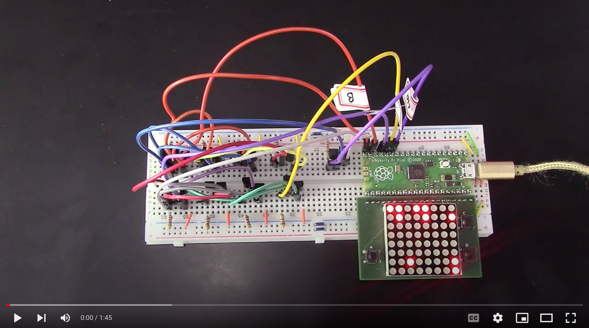

# Binary Full-Adder (Homework 4)

In this homework you will create an simple computing machine capable of summing up two numbers together.

Click on the image below to see a [demo video]() of how the timer works:

<a href="">

</a>

The **objectives** of this homework are to learn:

- how to use MOSFET and combine them in digital gates
- bitwise operations - how to add up two bytes

## Content of this folder

- [_SubmissionForm.md_](./SubmissionForm.md): the form containing the information about your submission.
- _src_: the template code to start the project
- _data_: a folder with the schematics and images used in this document.
- _README_: this file, containing the instructions.

## How does the adder work?

## Bill of Material (BOM)

| Designator | Name | Quantity |
| ---------- | ---- | -------- |

## Details about the Firmware Firmware

The firmware should be written in MicroPython and should run on the micro:bit.

## Submission and grading

You have to submit the following items:

1. The submission form containing your information and video link: [_SubmissionForm.md_](./SubmissionForm.md)
2. Clear photos (3 max) of your breadboard circuit
3. Your MicroPython sketch with the code

Take clear photos of your breadboard, the [_SubmissionForm.md_](./SubmissionForm.md), and the code, zip them together (_zip_, not _ALZIP_, _rar_ or others) and submit this resulting file using the [homework submission system](https://homework.prototyping.id). Make sure the zip file is smaller than 20MB.

**DO NOT SUBMIT THE VIDEO USING THE HOMEWORK SYSTEM**. Instead, upload the video online (YouTube, Google Drive...) and place a public link to the video inside the [_SubmissionForm.md_](./SubmissionForm.md) file. The video should show a working demo of your prototype. Feel free to use a voice-over explaining how the system is working.

Please note that:

1. Only submissions made with the system will be considered (no direct emails to TA or Prof).
2. You can re-submit as many times as you want before the deadline &ndash; we will consider your last submission.
3. Submissions after the deadline are **NOT** accepted.
4. If the file is too large the system won’t allow the submission. Remove from the zip file unnecessary files, and make sure to compress your images.
5. Do not copy from the Internet or colleagues without attribution. Remember the _honor code policy_.
