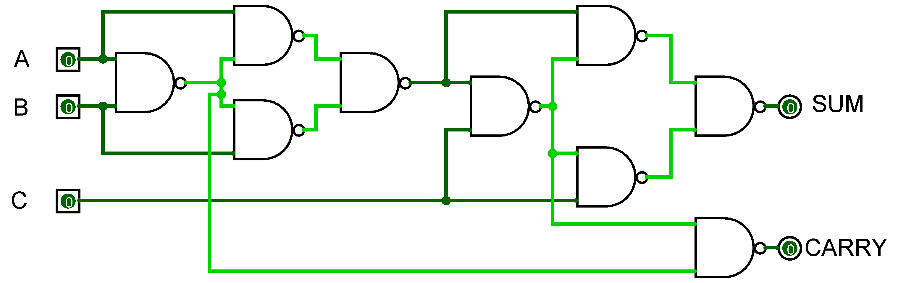
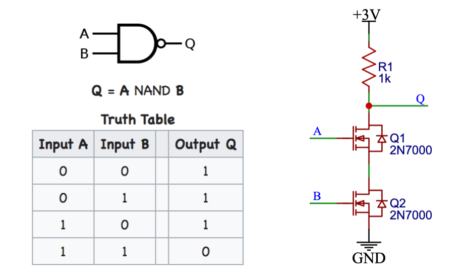
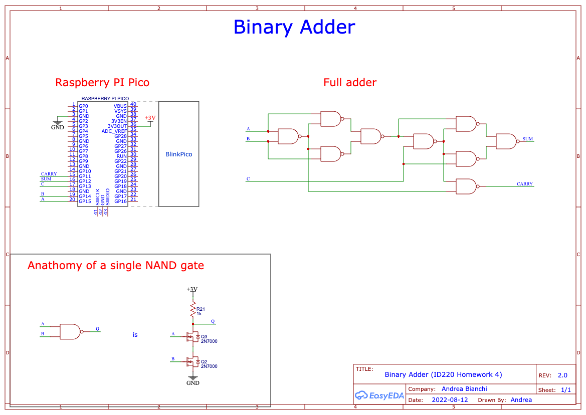
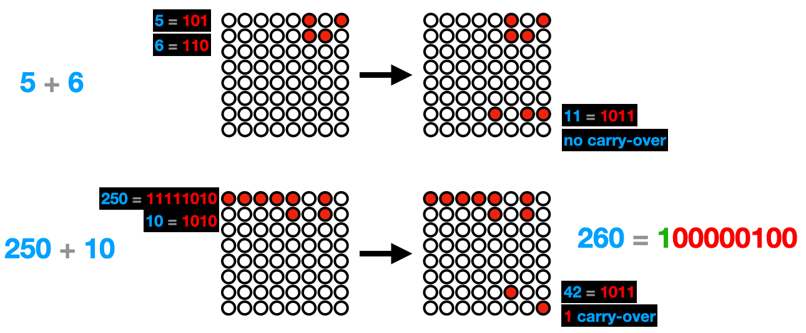
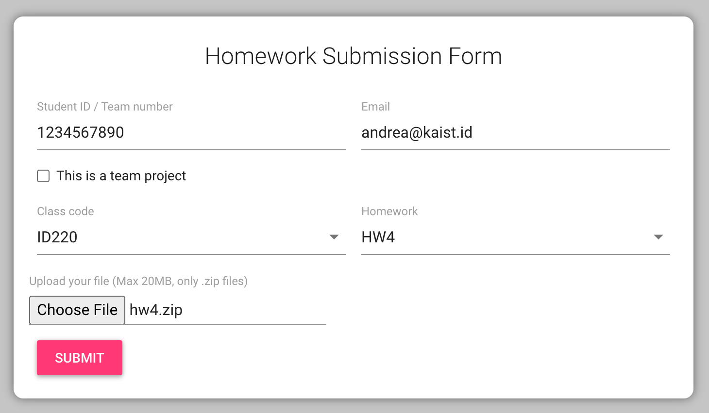

# Binary Full-Adder (Homework 4)

In this homework you will create an simple computing machine capable of summing up two numbers together.

Click on the image below to see a [demo video]() of how the timer works:

<a href="https://youtu.be/cbyGPSSKz-8">
<p align="center">

</p>
</a>

The **objectives** of this homework are to learn:

- how to use MOSFET and combine them in digital gates
- bitwise operations - how to add up two bytes

## Content of this folder

- [_SubmissionForm.md_](./SubmissionForm.md): the form containing the information about your submission.
- _src_: the template code to start the project
- _data_: a folder with the schematics and images used in this document.
- _README_: this file, containing the instructions.

## How does the adder work?

The diagram below shows the diagram of a [full adder](<https://en.wikipedia.org/wiki/Adder_(electronics)>) - a circuit that performs addition on two single binary digits A and B as well as a valued carrier in (C), and returns the SUM and the CARRY out. Click on the image below to see the [adder simulation](https://tinyurl.com/yj7ultw8).

<a href="https://tinyurl.com/yj7ultw8">
<p align="center">

</p>
</a>

The adder above is constructed only using [NAND gates](https://en.wikipedia.org/wiki/NAND_gate): the NAND gate (NOT-AND) is a logic gate which produces an output which is false only if all its inputs are true (the complement of an AND gate).

The image below shows how the NAND gate works and how you can construct one using two transistors (MOSFET) placed in series.

<p align="center">

</p>

In the assignment you will have to construct the adder above using only the MOSFET (2N7000). Here the [schematics](data/schematics.pdf) of the full circuit you will have to implement.

<a href="data/schematics.pdf">
<p align="center">

</p>
</a>

In practice, you can use the digital output pins 0, 1 and 2 to represent three bits that should be added (A and B and the carry-in C). The result of this sum can be read with the digital input pins 8 (SUM) and 16 (CARRY out). The micro:bit will therefore take two 5-bits numbers and sum them together, bit by bit. See the session about the [Firmware](#firmware) below for details about the software.

### Bill of Material (BOM)

| Description   | Name/Value | Quantity |
| ------------- | ---------- | -------- |
| MOSFETs       | 2N7000     | 18       |
| Resistors     | 1K         | 9        |
| Jumper cables |            | Many     |

- You can buy the MOSFTET from [here](https://www.devicemart.co.kr/goods/view?no=12089). Note that they sell packs of 10.

## Firmware

The firmware should be written in MicroPython and should run on the micro:bit.

The micro:bit performs the addition on two randomly generated 5-bits numbers (can store values from decimal 0 to 31). The two random numbers are displayed in the first two rows (little endian format). So, for example the decimable numbers 5 and 6 are represented as `00101` and `00110` respectively. Their sum is 11, in binary `01011`. This addition is not performed by the micro:bit, but instead using the adder circuit above.


<p align="center">

</p>

For each of the bits of the two input numbers, an addition is performed by setting the digital output level of P0 and P1 to the `HIGH` or `LOW` states. If any bitwise sum has a carryover, the pin P2 is set `HIGH` for the next addition. The final result is displayed at row 3, and eventual **overflows** (e.g., CARRY out of the addition for the last bit) is shown as a single bit on on row 4. See the examples above or the video for more details.

To complete the assignment you will have to implement two functions (in the [main.py](src/main.py) included)

```python
def bitSum(b1, b2, carry):
  ...
  
def sumRow(n1, n2):
  ...
```

## Submission and grading

You have to submit the following items:

1. The submission form containing your information and video link: [_SubmissionForm.md_](./SubmissionForm.md)
2. Clear photos (3 max) of your breadboard circuit
3. Your MicroPython sketch with the code

Take clear photos of your breadboard, the [_SubmissionForm.md_](./SubmissionForm.md), and the code, zip them together (_zip_, not _ALZIP_, _rar_ or others) and submit this resulting file using the [homework submission system](https://homework.prototyping.id). Make sure the zip file is smaller than 20MB.

**DO NOT SUBMIT THE VIDEO USING THE HOMEWORK SYSTEM**. Instead, upload the video online (YouTube, Google Drive...) and place a public link to the video inside the [_SubmissionForm.md_](./SubmissionForm.md) file. The video should show a working demo of your prototype. Feel free to use a voice-over explaining how the system is working.

<p align="center">

</p>

Please note that:

1. Only submissions made with the system will be considered (no direct emails to TA or Prof).
2. You can re-submit as many times as you want before the deadline &ndash; we will consider your last submission.
3. Submissions after the deadline are **NOT** accepted.
4. If the file is too large the system won’t allow the submission. Remove from the zip file unnecessary files, and make sure to compress your images.
5. Do not copy from the Internet or colleagues without attribution. Remember the _honor code policy_.
