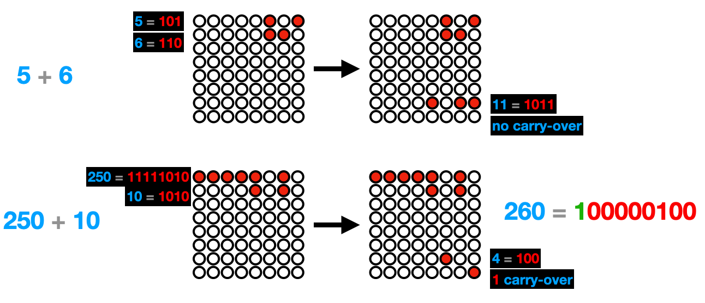

# Homework 4: Binary Full-Adder

In this homework, you will create a simple computing machine capable of summing up two numbers together.

Click on the image below to see a [demo video](https://youtu.be/nP0foCpszW4) of how the timer works:

<a href="https://youtu.be/nP0foCpszW4">

</a>

The **objectives** of this homework are to learn:

- how to use MOSFET and combine them in digital gates
- bitwise operations - how to add up two bytes

## Content of this folder

- [_SubmissionForm.md_](./SubmissionForm.md): the form containing the information about your submission.
- _src_: the template code to start the project
- _data_: a folder with the schematics and images used in this document.
- _README_: this file, containing the instructions.

## How does the adder work?

The diagram below shows the diagram of a [full adder](<https://en.wikipedia.org/wiki/Adder_(electronics)>) - a circuit that performs addition on two single binary digits A and B as well as a valued carried in (C), and returns the SUM and the CARRY-out. Click on the image below to see the [adder simulation](https://tinyurl.com/yj7ultw8).

<a href="https://tinyurl.com/yj7ultw8">

</a>

The adder above is constructed only using [NAND gates](https://en.wikipedia.org/wiki/NAND_gate): the **NAND** gate (_NOT-AND_) is a logic gate that produces an output that is false only if all its inputs are true (the complement of an AND gate).

The image below shows how the NAND gate works and how you can construct one using two transistors (MOSFET) placed in series.

In this assignment, you will have to construct the adder above using only the MOSFET (**2N7000**). Here are the [schematics](./data/schematics.pdf) of the full circuit you will have to implement.

<a href="./data/schematics.pdf">

</a>

In practice, you can use the digital output pins (e.g., GP15, GP14, GP13) to represent three bits that should be added (A and B and the carry-in C). The result of this sum can be read with two digital input pins, like GP12 (SUM) and GP11 (CARRY). The RPi will therefore take two 8-bit numbers and sum them together, bit by bit. See the session about the [Firmware](#firmware) below for details about the software.

### Bill of Material (BOM)

| Description   | Name/Value | Quantity |
| ------------- | ---------- | -------- |
| MOSFETs       | 2N7000     | 18       |
| Resistors     | 1K         | 9        |
| Jumper cables |            | Many     |

- You can buy the MOSFET from [here](https://www.devicemart.co.kr/goods/view?no=12089). Note that they sell packs of 10.

---

## Firmware

The firmware should be written in MicroPython and should run on the Raspberry PI Pico.

The RPi performs the addition on two randomly generated bytes (i.e., two 8-bit numbers, which can store values from decimal 0 to 255 included). The two random bytes are displayed in the first two rows (little endian format). So, for example, the decimal numbers 5 and 6 are represented as `00000101` and `00000110` respectively. Their sum is 11, in binary `00001011`. This addition is not performed by the RPi but instead uses the adder circuit constructed in the circuit above.

For each of the bits of the two input numbers, an addition is performed by setting the digital output level of pins corresponding to A and B to the `HIGH` or `LOW` states. If any bitwise sum has a carryover, the pin indicating C is set `HIGH` for the next addition. The final result is displayed in row 6, and eventual **overflows** (e.g., CARRY out of the addition for the last bit) is shown as a single bit on row 7 (the last row). See the examples above or the video for more details.

To complete the assignment you will have to implement the code that generates and displays two random numbers and then that it sums them by correctly changing the values of A, B, and C for each bitwise addition. The result of each computation can be read using the input digital pins representing SUM and CARRY.

## Submission and grading

You have to submit the following items:

- The form with your information: [_SubmissionForm.md_](./SubmissionForm.md)(`10%`)
- A video demo of your demo with the prototype. The video should have decent quality, so consider editing it. (`35%`)
- Clear photos (max 3) of your breadboard circuit showing the circuit overview and details (`20%`)
- Your MicroPython code (`35%`)

Take clear photos of your breadboard, the [_SubmissionForm.md_](./SubmissionForm.md), the submission form, the code, zip them together (_zip_, not _ALZIP_, _rar_ or others) and submit this resulting file using the [homework submission system](https://homework.prototyping.id). Make sure the zip file is smaller than 20MB.

**DO NOT SUBMIT THE VIDEO USING THE HOMEWORK SYSTEM**. Instead, upload the video online (YouTube, Google Drive...) and place a public link to the video inside the [_SubmissionForm.md_](./SubmissionForm.md) file.

Please note that:

1. Only submissions made with the system will be considered (no direct emails to TA or Prof).
2. You can re-submit as many times as you want before the deadline &ndash; we will consider your last submission.
3. Submissions after the deadline are **NOT** accepted.
4. If the file is too large the system won’t allow the submission. Remove from the zip file unnecessary files, and make sure to compress your images.
5. Do not copy from the Internet or colleagues without attribution. Remember the _honor code policy_.
6. The instructor reserves the right of assigning, at his discretion, a bonus or penalty of up to 10% (e.g., qualitative assessment of the code or of the prototype).
